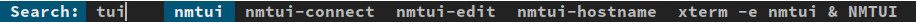
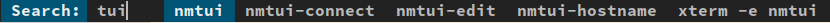

# Commandbase Patch
A simple patch to add arbitrary commands to dmenu

A user might have many commands that they wish to execute but the list of "necessary" commands might grow to be too large at some point or even the command itself might be too large to type out everytime

This patch allows the user to bake several commands of any length, along with an alias, and make it searchable in dmenu directly

Since the patch is so general, the user can define any kind of command since it will be executed as is from dmenu and it will function the same as if it were launched from a terminal

There is an exception, dmenu doesnt handle TUIs very well so a workaround of defining a terminal to open the TUI application should be used as shown below

A sample file has been given (commands.conf) to show how the commands can be defined

In the following example
```
alias=NMTUI
cmds=xterm -e nmtui
```

This would be the output


But alternatively in this example
```
alias=
cmds=xterm -e nmtui
```

This would be the output


To update the list in dmenu you just have to remove `~/.cache/dmenu_run` and then run `./dmenu_path` (from within your local dmenu directory) which will create a new file with the updated list that dmenu will use from now on

The alias parameter is optional and if the command itself has the name of the program then it can be left empty, it is only provided for convenience

The alias is mostly useful in a situation where the program itself does not exist in the full command like in the example for a webapp below


Another such example for making things easier would be opening a VM with specific settings and parameters directly from a command instead of opening a GUI and then turning it on like this,
- `VBoxManage startvm "vm_1" --type separate & windows`

In the above example a windows VM, that has already been setup, can just be launched with a singular action whenever the user feels like it
